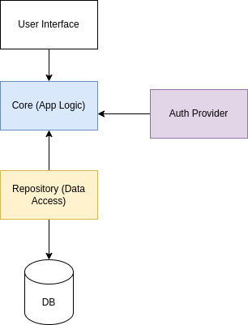
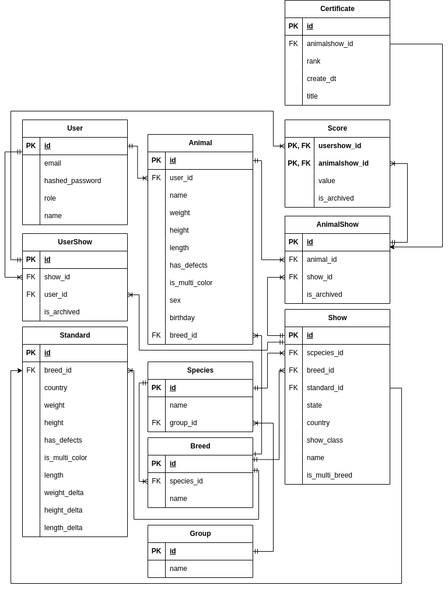
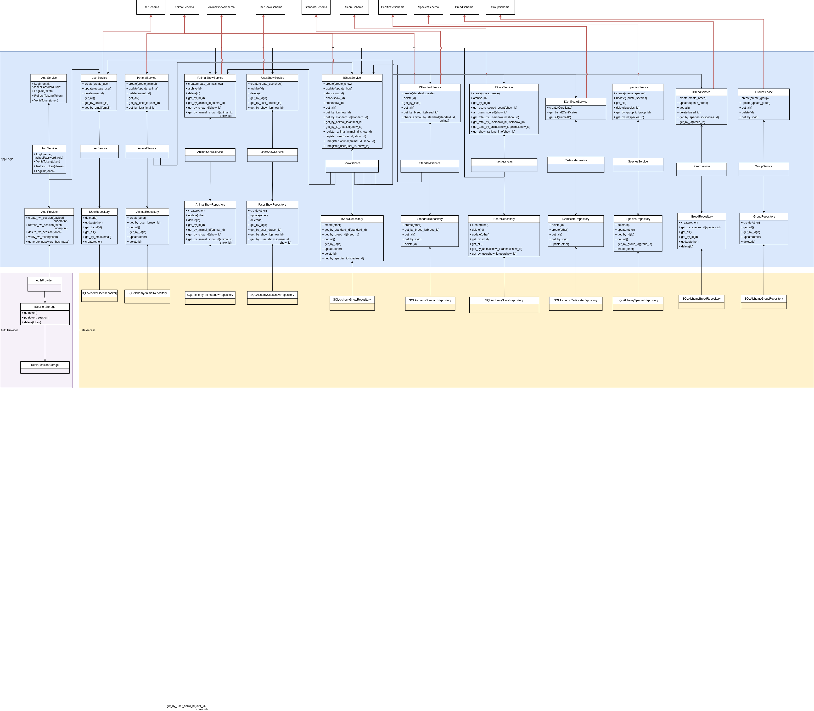

### 1. Название проекта

Выставочное агенство "Выставлятор" (организация выставок различных видов животных)

### 2. Краткое описание идеи проекта

Приложение, имитирующее работу выставочного агенства. Приложение должно предоставлять функционал для заводчиков, судьей, организаторов.

### 3. Краткое описание предметной области

| <b>Понятие</b> |<b>Определение</b> |
|---|---|
| Животное | Живое существо, обладающее характеристиками: рост, вес, окрас, наличие дефектов |
|Вид|Основная структурная единица биологической систематики животных (Собака, Кошка, Волк, Домашняя лошадь и так далее)|
|Порода|Группа животных одного вида, обладающая определенными  характеристиками, передающимися по наследству (Вид: кошка, порода: сфинкс, корниш-рекс и т.д.) |
|Стандарт породы (вида)|Документ, описывающий значения характеристик животного,  принадлежащего породе (виду), и допустимые диапазоны  их изменений|
|Заводчик| Человек, занимающийся разведением животных и являющийся их хозяином |
| Выставка животных | Публичное мероприятие по оценке степени соответствия участников стандарту вида или породы |
|Участник выставки|Животное, записанное на выставку своим заводчиком|
|Судья|Человек, который после получения специального образования имеет право в зависимости от полученного образования судить животных той или иной породы|
|Приглашенный (на выставку) судья|Судья, имеющий право оценивать участников отдельной выставки|
|Организатор|Человек, который имеет право создавать, редактировать, запускать и завершать выставки|

### 4. Краткий анализ аналогичных решений

Критерии:

1. Наличие возможности регистрации животных разных видов.
2. Наличие возможности проведения всех этапов выставки в онлайн-формате.
3. Наличие возможности автоматической обработки результатов оценки участников.

|   | 1 | 2 | 3 |
|---|---|---|---|
| cats-show.org | - | + | - |
| brd-show.online | - | + | + |
| www.show-dogs.ru | - | - | - |
| dog-planeta.ru | - | - | - |
| Онлайн-выставка "Мой питомец" с использованием ВКонтакте | + | + | - |
| Предлагаемое решение | + | + | + |

### 5. Краткое обоснование целесообразности и актуальности проекта

В 21 веке вследствие увеличения доступности информации появляется все больше людей, увлекающихся разведением домашних животных, относящихся к видам, которые распространены меньше, чем кошки и собаки, а также разводящих несколько видов одновременно, поэтому целесообразно создание проекта, который объединяет организацию выставок для различных видов животных.

Работа над данным проектом является актуальной, так как перевод выставок в онлайн-формат с автоматической обработкой результатов
- упрощает работу судей,
- уменьшает трудозатраты на обработку результатов и распределение наград,
- снижает риск возникновения ошибок обработки.

Все рассмотренные возможности реализуются в данном проекте.

### 6. Краткое описание акторов (ролей)

1. Заводчик: зарегистрированный пользователь, который владеет 0 или более животными различных видов, может управлять записями своих животных, записывать их на выставки.
2. Судья: зарегистрированный пользователь, который может оценивать участников выставки, если является приглашенным судьей этой выставки.
3. Организатор: зарегистрированный пользователь, который управляет всеми выставками (создание, удаление, редактирование общей информации, управление списком приглашенных судей).
4. Гость: может посмотреть список выставок, результаты выставки.

### 7. Use-Case - диаграмма

На рисунке ниже представлена Use-Case диаграмма.

На рисунке ниже представлен общий вид результатов завершенной выставки.

### 8. ER-диаграмма сущностей

На рисунке ниже представлена ER-диаграмма сущностей.

#### Диаграмма состояний

На рисунке ниже представлена диаграмма переходов состояний выставки.

### 9. Пользовательские сценарии

1. ПРОСМОТР ВЫСТАВОК
	1. Пользователь входит как Гость/Заводчик/Судья/Организатор
	2. Гость/Заводчик/Судья/Организатор смотрит список выставок
2. ДОБАВЛЕНИЕ ЖИВОТНОГО
	1. Пользователь входит как Заводчик
	2. Заводчик добавляет животное
3. СОЗДАНИЕ ВЫСТАВКИ
	1. Пользователь входит как Организатор
	2. Организатор создает выставку

#### Сложные сценарии

4. УДАЛЕНИЕ СУДЬИ
	1. Пользователь входит как Организатор
	2. Организатор выбирает выставку
	3. Организатор хочет удалить судья
	4. Прервать действие, если выставка в состоянии "Запущена" или "Завершена"
	5. Прервать действие, если на выставке нет приглашенных судьей
	6. Организатор выбрал судью
	7. Удалить судью с выставки
5. ПРИГЛАШЕНИЕ СУДЬИ
	1. Пользователь входит как Организатор
	2. Организатор выбирает выставку
	3. Организатор хочет добавить судью на выставку
	4. Прервать действие, если выставка в состоянии "Запущена" или "Завершена"
	5. Прервать действие, если судья приглашен на выбранную выставку
	6. Добавить судью на выставку (пометить его как приглашенного)
6. РЕДАКТИРОВАНИЕ ВЫСТАВКИ
	1. Пользователь входит в систему как Организатор
	2. Организатор выбирает выставку
	3. Организатор хочет редактировать информацию о выставке
	4. Прервать действие, если выставка в состоянии "Запущена" или "Завершена"
	5. Редактировать информацию о выставке
6. ЗАПУСК ВЫСТАВКИ
	1. Пользователь входит в систему как Организатор
	2. Пользователь выбирает выставку
	3. Организатор хочет запустить выставку
	4. Прервать действие, если выставка в состоянии "Завершена"
	5. Прервать действие, если на выставку записано менее 3 участников
	6. Прервать действие, если нет приглашенных судей
	7. Отметить выставку запущенной
7. ЗАВЕРШЕНИЕ ВЫСТАВКИ
	1. Пользователь входит в систему как Организатор
	2. Организатор выбирает выставку
	3. Организатор хочет завершить выставку
	4. Прервать действие, если выставка не в состоянии "Запущена"
	5. Прервать действие, если есть хотя бы один судья, не оценивший всех участников
	6. Перевести выставку в состояние "Завершена"
	7. Вычислить результаты выставки
8. УДАЛЕНИЕ ЖИВОТНОГО
	1. Пользователь входит в систему как Заводчик
	2. Заводчик хочет удалить животное
	3. Прервать действие, если заводчик не имеет животных
	4. Заводчик выбирает животное
	5. Прервать действие, если животное является участником хотя бы одной выставки в состоянии "Запущена"
	6. Отметить данные о результатах выставок в состоянии "Завершена", в которых участвовало животное, как архивные
	7. Удалить животное из системы
9. ЗАПИСЬ ЖИВОТНОГО НА ВЫСТАВКУ
	1. Пользователь входит в в систему как Заводчик
	2. Заводчик хочет записать животных на выставку
	3. Прервать действие, если заводчик не имеет животных
	4. Прервать действие, если заводчик не имеет животных, подходящих по виду и/или породе
	5. Заводчик выбирает животное
	6. Прервать действие, если выбранное животное уже записано на выставку
	7. Прервать действие, если выбранное животное не соответствует стандарту выставки
	8. Записать животное на выставку
10. ПРОСМОТР РЕЗУЛЬТАТОВ ВЫСТАВКИ
	1. Пользователь входит как Гость/Заводчик/Судья/Организатор
	2. Пользователь выбирает выставку
	3. Пользователь хочет посмотреть результаты выставки
	4. Прервать действие, если выставка не в состоянии "Завершена"
	5. Сформировать отчет о результатах выставки
	6. Предоставить отчет пользователю

### 10. Формализация ключевых бизнес-процессов

На рисунке ниже представлена диаграмма процесса входа в систему и выполнения начальных действий.

#### Необходимые проверки

1. Посмотреть результаты выставки
	- прервать действие, если выставка не в состоянии "Завершена"
2. Удалить животное
	- прервать действие, если животное является участником хотя бы одной запущенной выставки
3. Управлять записями животного
	1. Записать животное на выставку
		- прервать действие, если выставка не в состоянии "Открыта"
		- прервать действие, если вид или порода животного не подходят
		- определить стандарт породы, соответствующий стране выставки
		- прервать действие, если животное не соответствует стандарту
	2. Отписать животное от выставки
		- прервать действие, если животное не записано на выставку
		- прервать действие, если выставка не в состоянии "Открыта"
8. Проверка соответствия животного стандарту:
	- прервать действие, если дефекты недопустимы и имеются дефекты
	- прервать действие, если животное многоцветное и многоцветность не допускается
	- прервать действие, если рост животного не входит в допустимый интервал
	- прервать действие, если вес животного не входит в допустимый интервал
	- прервать действие, если индекс растянутости животного не входит в допустимый интервал
5. Редактировать выставку
	- прервать действие, если выставка в состоянии "Запущена" или "Завершена"
6. Изменить состояние выставки
	1. Запустить выставку
		- прервать действие, если выставка в состоянии "Запущена" или "Завершена"
		- прервать действие, если на выставку записано менее 3 животных
		- прервать действие, если на выставке нет хотя бы одного приглашенного судьи
	2. Завершить выставку
		- прервать действие, если выставка в состоянии "Открыта" или "Завершена"
		- прервать действие, если хотя бы один приглашенный судья не оценил каждого участника
7. Управлять списком приглашенных судей
	1. Добавить судью на выставку
		- прервать действие, если выставка в состоянии "Запущена" или "Завершена"
		- прервать действие, если судья приглашен на эту выставку
	2. Удалить судью с выставки
		- прервать действие, если выставка в состоянии "Запущена" или "Завершена"

### 11. Описание типа приложения и выбранного технологического стека

Приложение: Web SPA

Технологический стек: Scala

### 12. Верхнеуровневое разбиение на компоненты

### 13. UML диаграммы классов

#### Диаграмма классов сущностей БД

#### Диаграмма классов компонентов бизнес-логики и доступа к данным

