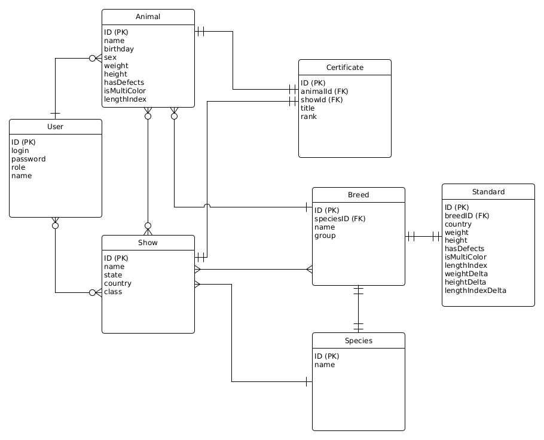
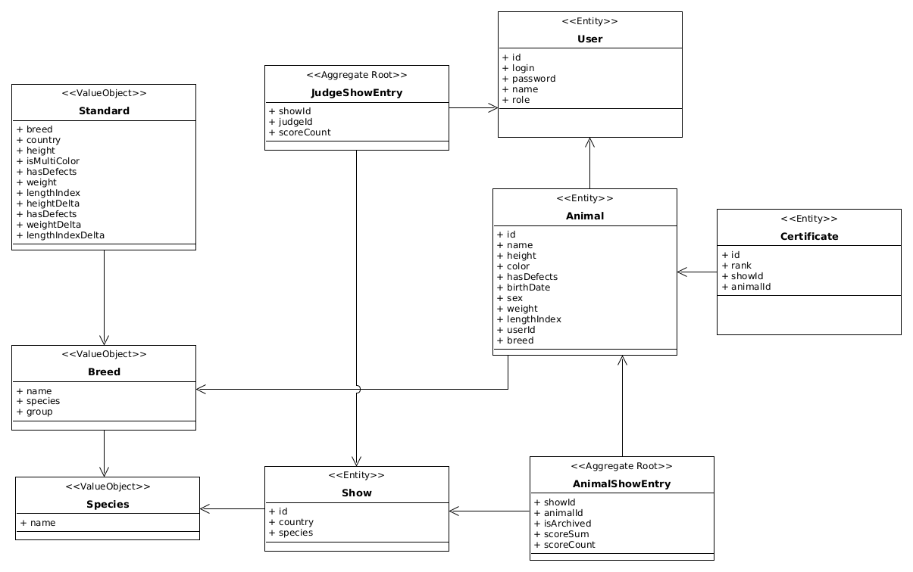
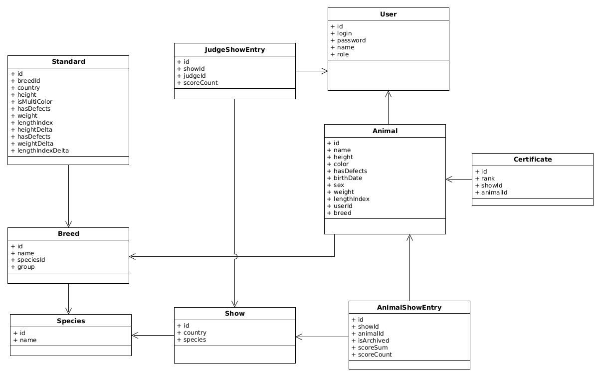
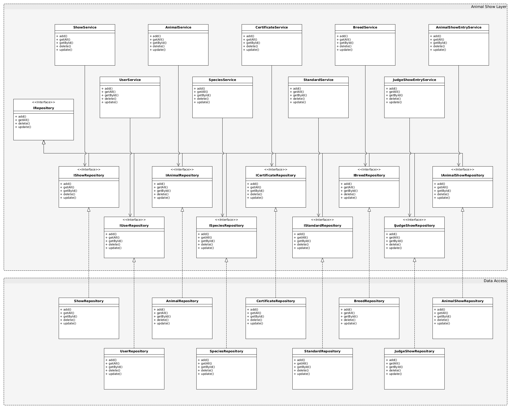

### 11. Описание типа приложения и выбранного технологического стека

Приложение: Web SPA

Технологический стек: Scala (веб с помощью Scala.js)

### 12. Верхнеуровневое разбиение на компоненты

### 13. UML диаграммы классов

#### Диаграмма классов сущностей БД

#### Диаграмма классов сущностей системы

#### Диаграмма транспортных сущностей

#### Диаграмма классов компонентов бизнес-логики и доступа к данным

